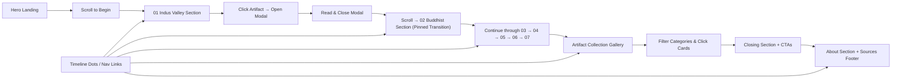

## 1. Product Overview

"INDIAN ART — A JOURNEY THROUGH TIME" is a premium, cinematic, highly interactive educational digital museum experience that explores Indian art history across 7 major historical periods. Users navigate chronologically through scroll-driven animations, discovering key artifacts and their cultural significance.

- **Purpose**: Academic assignment submission (Interactive Timeline with Artifacts — Indian Art History, CO1, 10 marks)
- **Target Users**: Students, educators, art enthusiasts, and anyone interested in Indian cultural heritage
- **Core Value**: Delivers an immersive, premium museum-quality experience that transforms chronological learning into a cinematic, emotionally engaging journey

---

## 2. Core Features

### 2.1 User Roles

| Role | Registration Method | Core Permissions |
|------|---------------------|------------------|
| Visitor | None required | Full access to browse timeline, view artifacts, use collection gallery |

### 2.2 Feature Module

1. **Global Navigation**: Minimal fixed header with brand, section links, timeline progress (01/07), clickable period indicator
2. **Hero Section**: Cinematic opening with floating artifact, oversized typography, scroll-to-begin CTA, mouse-parallax
3. **7 Historical Period Sections** (pinned scroll sections):
   - 01 Indus Valley (2500 BCE) — Dancing Girl, seals, terracotta
   - 02 Buddhist & Classical (200 BCE–600 CE) — Ajanta paintings, Sanchi, Gandhara
   - 03 Temple & Medieval (600–1200 CE) — Chola Nataraja bronze
   - 04 Mughal & Courtly (1500–1800 CE) — Miniature paintings
   - 05 Regional Painting Traditions — Madhubani, Warli, Kalamkari, Pattachitra, Rajasthani, Pahari, Tanjore
   - 06 Colonial & Transitional (1800–1947) — Raja Ravi Varma, Company School, Bengal School
   - 07 Modern & Contemporary (1947–Present) — Amrita Sher-Gil, M.F. Husain
4. **Interactive Artifact Modal**: Click-to-open detailed artifact view with image, metadata, academic descriptions
5. **Artifact Collection Gallery**: Filterable grid of all artifacts (ALL / ANCIENT / MEDIEVAL / MUGHAL / REGIONAL / MODERN)
6. **Final Closing Section**: Cinematic outro with CTAs to "Explore the Collection" and "Explore by Region"
7. **About Section**: Academic assignment information
8. **Sources/References**: Academic citations at page bottom

### 2.3 Page Details

| Page Name | Module Name | Feature description |
|-----------|-------------|---------------------|
| Single-page app | Global Navigation | Fixed minimal nav with: "INDIAN ART" brand, links (JOURNEY / ARTIFACTS / ABOUT), dynamic progress counter (01/07), clickable vertical timeline indicator (desktop) |
| Single-page app | Hero Section | Full-screen cinematic. Headline "INDIAN ART" + "A JOURNEY THROUGH TIME". Floating central artifact with mouse parallax and scroll-driven transform. Scroll prompt with animated arrow. |
| Single-page app | Timeline Periods | 7 pinned ScrollTrigger sections. Each: unique visual theme, central artifact (pins while text animates around), period title + theme subtitle, supporting text, additional artifacts. Artifact hover parallax + click opens modal. Transition between sections via scroll-triggered transforms (scale/translate/clip-path/opacity). |
| Single-page app | Artifact Modal | Fullscreen elegant modal. Animates in with image expand + text slide-in. Contains: ARTIFACT NAME, Period, Location, Material, Technique, About the Artifact, Historical Context, Artistic Significance. Close button. Accessible via keyboard. |
| Single-page app | Artifact Collection Gallery | Grid layout with filter bar. Filter buttons: ALL | ANCIENT | MEDIEVAL | MUGHAL | REGIONAL | MODERN. Cards show image + name + period + region. Click re-opens artifact modal. |
| Single-page app | Closing Section | Cinematic dark outro. Large text "THE STORY CONTINUES." + supporting paragraph. Two CTAs: "EXPLORE THE COLLECTION →" and "EXPLORE INDIAN ART BY REGION →" |
| Single-page app | About Section | Subtle academic info: Assignment title, Course Outcome CO1, Marks 10, brief description of the project. |
| Single-page app | Sources | Footer list of reputable museum / academic sources used for artifact content. |

---

## 3. Core Process

**Main User Flow**:
User lands on cinematic hero → Reads scroll prompt → Scrolls down → Hero artifact scales/moves → Indus Valley section pins into view → User reads + views artifact → Clicks Dancing Girl → Modal opens with full artifact details → Closes modal → Continues scrolling → Each successive period transitions via cinematic animation (one visual space transforms into the next) → Progress indicator and timeline update automatically → User can click timeline dots to jump to any period → After last period reaches Artifact Collection Gallery → User can filter artifacts by category → Click any artifact card to re-open its detail modal → Reaches Closing Section with CTAs → Scrolls to About + Sources footer.

Alternative flows:
- User clicks timeline dot from anywhere → Smooth scrolls to that period
- User clicks nav links → Smooth scrolls to JOURNEY (start of timeline) / ARTIFACTS (collection) / ABOUT sections
- User at any artifact clicks it → Modal opens → User reads → Closes
- User in collection filters by category → Clicks card → Modal opens

---

## 4. User Interface Design

### 4.1 Design Style

- **Aesthetic**: Luxury museum + cinematic documentary + interactive art exhibition
- **Color Palette**:
  - Background: Deep charcoal (#1a1a1a) to near-black (#0d0d0d) with period-specific tint overlays
  - Text: Warm ivory (#f5ecd7) + parchment cream (#e8dcc0)
  - Accents: Muted bronze (#b08d57) / terracotta (#c17f59) / sandstone (#d4a574)
  - Grain/noise texture overlay for depth
- **Buttons**: Thin line borders, uppercase tracking, subtle hover (border fill + text shift), no heavy shadows
- **Typography**:
  - Display font: Elegant serif for headlines (e.g., Cormorant Garamond or Playfair Display) — oversized, sometimes overlapping imagery
  - Body font: Refined modern serif/sans (e.g., EB Garamond, Libre Franklin) — highly readable at small sizes
  - Extensive use of letter-spacing + line-height variation for editorial feel
- **Layout**: Asymmetrical, overlapping typography/imagery, pinned central visuals with surrounding text layers that animate independently, thin SVG dividers, generous negative space
- **Icon Style**: Lucide (thin-line, minimal, stroke-matched to bronze/ivory)

### 4.2 Page Design Overview

| Page Name | Module Name | UI Elements |
|-----------|-------------|-------------|
| SPA | Global Nav | Fixed top bar (low opacity bg, backdrop-blur subtle). Left brand serif. Right uppercase nav links. Center-right progress counter "01 / 07". Desktop-only left/right vertical clickable period dots with connecting line. |
| SPA | Hero Section | Full viewport height, dark grain bg, centered floating Dancing Girl artifact (slow float + mouse tilt + scroll scale-down/translateX). Massive display-font "INDIAN ART" stacked with "A JOURNEY THROUGH TIME" subtitle. Bottom-center animated scroll prompt with SVG arrow. |
| SPA | Period Sections | Each section has its own tinted bg texture (sandstone→cave-dark→stone-gray→rich-gold→vibrant→paper→minimal-white). Central artifact pins via ScrollTrigger. Left/right/below text layers slide/fade/scale/clipPath-reveal as user scrolls within the pinned section. Artifacts react to mouse tilt/scale on desktop. Click cursor changes to +zoom. |
| SPA | Artifact Modal | Fullscreen semi-transparent black (90% opacity) backdrop. Image expands from clicked artifact position. Two-column layout: large image (left) + metadata & text (right). Close button (X, top-right, large tap target). Smooth entrance/exit GSAP timeline. |
| SPA | Collection Gallery | Wide container. Filter bar above grid (pill-style buttons, active state has bronze fill). 3–4 col grid (desktop), 2 (tablet), 1 (mobile). Cards: image aspect-tight crop, name serif subtitle, period/region tag in small uppercase. Hover: subtle lift + image zoom 3%. |
| SPA | Closing Section | Full viewport height, dark (or near-black) bg, massive centered serif subtitle, paragraph below in warm ivory, two side-by-side CTAs with arrow SVG icons. |
| SPA | About + Sources | Subtle section in slightly lighter charcoal. Two columns: Assignment info (left) + Sources list (right). Thin SVG dividers. Small serif text. |

### 4.3 Responsiveness

- **Desktop-first** design; tablet and mobile adapt with media queries
- **Desktop (≥1200px)**: Full cinematic experience, pinned ScrollTrigger sections, vertical timeline side indicator, maximum typography scale and overlap, 4-col gallery grid
- **Laptop (≥900px)**: Near-identical to desktop; slightly reduce typography scale + overlap; 3-col gallery
- **Tablet (≥600px)**: Simplify parallax intensity; replace vertical side timeline with compact horizontal progress bar below nav; 2-col gallery; reduce text overlap to preserve readability
- **Mobile (<600px)**: Disable most pinned sections (use stacked sections with simpler fade/translate); convert vertical timeline indicator to compact segmented progress; 1-col gallery; all artifact modals fullscreen mobile-friendly; ensure no horizontal overflow; reduce number of concurrent GSAP animations to keep smoothness; replace hover micro-interactions with tap
- **Touch optimization**: Larger tap targets (≥44px), swipe-friendly section transitions if feasible, disable :hover-only interactions, provide tap-to-activate artifact modals

### 4.4 3D Scene Guidance

Not applicable for this project.
