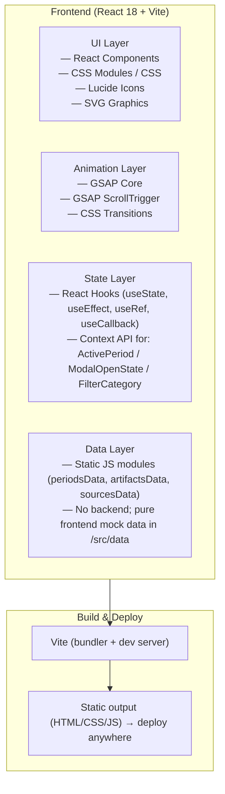
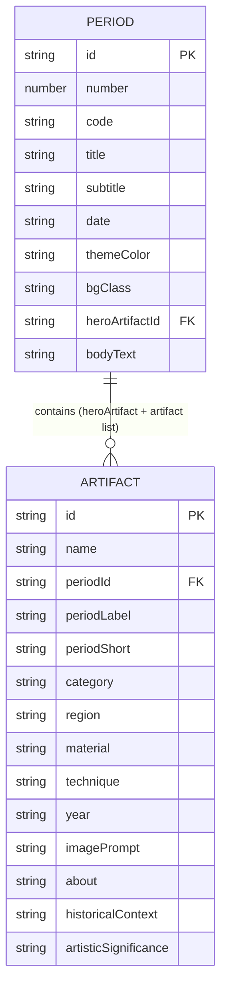

## 1. Architecture Design



## 2. Technology Description

- **Frontend Framework**: React 18 (function components + hooks only) — JavaScript (per user request; JS allows broader compatibility and simpler setup than TS for this scope; optionally TS if project template preference emerges, but plan default is JSX)
- **Bundler / Initialization**: Vite (`npm create vite@latest . -- --template react`)
- **Animation Engine**: GSAP 3 (core) + GSAP ScrollTrigger plugin — **non-negotiable** per requirements for cinematic scroll-driven transitions, pinned sections, clip-path reveals, parallax, scale/rotate/translate timelines
- **Styling**: Vanilla CSS 3 with CSS custom properties (themes per historical period) + component-scoped class naming convention (BEM-ish), **no Tailwind** (user said "HTML5 CSS3" and emphasizes a hand-tuned editorial aesthetic that benefits from hand-written CSS)
- **Icons**: `lucide-react` (lightweight, thin-line, match design aesthetic)
- **Images**: React `` with `loading="lazy"` and `decoding="async"` for non-critical artifacts; hero/critical images preloaded via `<link rel="preload">`; use provided text-to-image API URLs for artifact visuals
- **Routing**: None — single-page scroll-driven app; anchor-based smooth scrolling for nav jumps
- **Backend / Database / API**: None — 100% frontend as required

---

## 3. Route Definitions

Single-page application with anchor-only navigation (no React Router).

| Route / Anchor | Purpose |
|----------------|---------|
| `#hero` | Top of page / cinematic opening |
| `#journey` | Start of timeline period sections (01 Indus) |
| `#period-1` … `#period-7` | Individual historical periods (for timeline-dot jump navigation) |
| `#collection` | Artifact collection gallery with filters |
| `#closing` | Cinematic closing / CTAs |
| `#about` | Academic "About This Journey" section |
| `#sources` | Sources / References footer |

---

## 4. API Definitions

No backend / no API — all data is static ES module data in `/src/data/`.

Data contract shapes (defined in plain JS + JSDoc where helpful):

```js
// /src/data/periods.js — Period type
{
  id: "period-1",
  number: 1,
  code: "INDUS",
  title: "INDUS VALLEY CIVILIZATION",
  subtitle: "THE BEGINNING OF EXPRESSION",
  date: "Approximately 2500 BCE",
  themeColor: "#d4a574", // sandstone
  bgClass: "period-bg-indus",
  heroArtifactId: "dancing-girl",
  artifactIds: ["dancing-girl", "indus-seal-pashupati", "terracotta-figurine"],
  bodyText: "...",
  secondaryText: "...",
}

// /src/data/artifacts.js — Artifact type
{
  id: "dancing-girl",
  name: "Dancing Girl of Mohenjo-daro",
  periodId: "period-1",
  periodLabel: "Indus Valley Civilization",
  periodShort: "Ancient",      // for filter category
  category: "ANCIENT",        // ALL|ANCIENT|MEDIEVAL|MUGHAL|REGIONAL|MODERN
  region: "Mohenjo-daro, Sindh (present-day Pakistan)",
  material: "Bronze (lost-wax casting)",
  technique: "Cire perdue (lost-wax) bronze casting, approx. 10.8 cm high",
  year: "c. 2500 BCE",
  imagePrompt: "ancient indus valley bronze dancing girl statue artifact warm museum lighting dark background cinematic 4k",
  about: "Concise academic description...",
  historicalContext: "Why it matters in Indian art history...",
  artisticSignificance: "Artistic technique, symbolism, cultural meaning...",
}

// /src/data/sources.js — Source type
{ label: "National Museum, New Delhi — Indus Valley Gallery", url: "https://..." }
```

---

## 5. Server Architecture Diagram

Not applicable — no backend.

## 6. Data Model

### 6.1 Data Model Definition



### 6.2 Static Data Modules (no SQL — no DB)

Files created in `/src/data/`:
- `periods.js` — 7 period objects exported as an array + map by id
- `artifacts.js` — 15–20+ artifact objects (at least 2–3 per period) exported as array + map by id
- `sources.js` — references list
- `traditions.js` — for period-05 regional painting traditions data

### Component Structure (`/src/components/`)

```
src/
├── data/
│   ├── periods.js
│   ├── artifacts.js
│   ├── traditions.js
│   └── sources.js
├── hooks/
│   ├── useScrollProgress.js      — % scrolled + current period detection
│   ├── usePrefersReducedMotion.js
│   └── useMouseTilt.js           — artifact subtle parallax on mouse move
├── utils/
│   ├── imageUrls.js              — helper to build text-to-image URLs
│   └── scrollToAnchor.js
├── components/
│   ├── layout/
│   │   ├── GlobalNav.jsx
│   │   ├── TimelineProgress.jsx  — vertical dots + progress counter
│   │   └── Footer.jsx
│   ├── sections/
│   │   ├── HeroSection.jsx
│   │   ├── PeriodSection.jsx     — shared wrapper; 7 instances via map
│   │   ├── CollectionSection.jsx
│   │   ├── ClosingSection.jsx
│   │   └── AboutSection.jsx
│   ├── period-sub/
│   │   ├── PeriodHeroArtifact.jsx
│   │   ├── PeriodArtifactRow.jsx
│   │   └── RegionalTraditions.jsx  — period-05 special
│   ├── artifact/
│   │   ├── ArtifactCard.jsx
│   │   └── ArtifactModal.jsx
│   └── ui/
│       ├── FilterBar.jsx
│       └── RevealText.jsx          — text line/word reveal GSAP wrapper
├── styles/
│   ├── variables.css
│   ├── base.css
│   ├── layout.css
│   ├── periods.css
│   ├── modal.css
│   └── responsive.css
├── App.jsx
└── main.jsx
```

### ScrollTrigger Architecture

- `main.jsx`: Register GSAP + ScrollTrigger plugin once globally
- `PeriodSection.jsx`: Each period `div` has `data-period-id` and wraps an inner `pinned-container` with `pin: true` + `pinSpacing` for ScrollTrigger; Scroll start/end tuned so each period occupies ~3–6× viewport scroll distance (enough room for central artifact pin + text reveal transitions + transition to next period)
- Global "progress" timeline updates `TimelineProgress` counter + active dot via single `ScrollTrigger.create({ trigger: "#journey", start: "top top", end: "bottom bottom", onUpdate })`
- Individual `RevealText` / artifact entrance animations use `toggleActions` or `onEnter` scoped per element
- Section-to-section transitions use combination of: `clipPath inset → inset`, `scale: 0.7 → 1`, `xPercent -/+ 15`, `opacity 0 → 1`, `blur 12px → 0`

### Performance & Accessibility Plan

- **Performance**:
  - Lazy-load images (`loading="lazy"`, `decoding="async"`) except hero
  - `prefers-reduced-motion`: Skip all parallax/tilt/scale/rotate animations, keep only fades, disable pinning (stack sections normally)
  - Always `ScrollTrigger.refresh()` after fonts/images load; debounce resize listener
  - Minimize ScrollTrigger count: group many per-section animations into one `gsap.timeline({ scrollTrigger: {...} })` inside PeriodSection
  - Use `will-change` only on actively animated elements; remove after animation
- **Accessibility**:
  - Semantic headings: `<h1>` hero → `<h2>` period → `<h3>` artifact names → `<h4>` modal subsections
  - All images have descriptive `alt` (artifact name + period + "artwork")
  - Keyboard navigation: Nav links, period-dots in TimelineProgress, artifact cards, filter buttons, modal close (Esc to close, focus trap inside modal)
  - Visible `:focus-visible` outlines in bronze accent
  - WCAG AA contrast: ivory/charcoal tested (≥ 7:1)
  - Modal has `aria-modal`, `aria-labelledby`, `role="dialog"`, first focusable autofocus, trap focus, restores focus on close
  - No content visible only via hover
